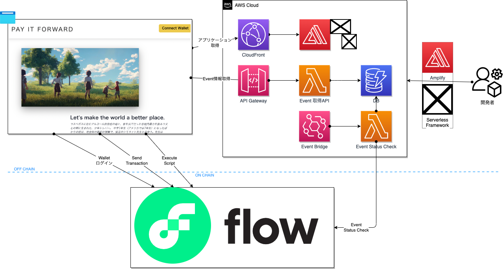
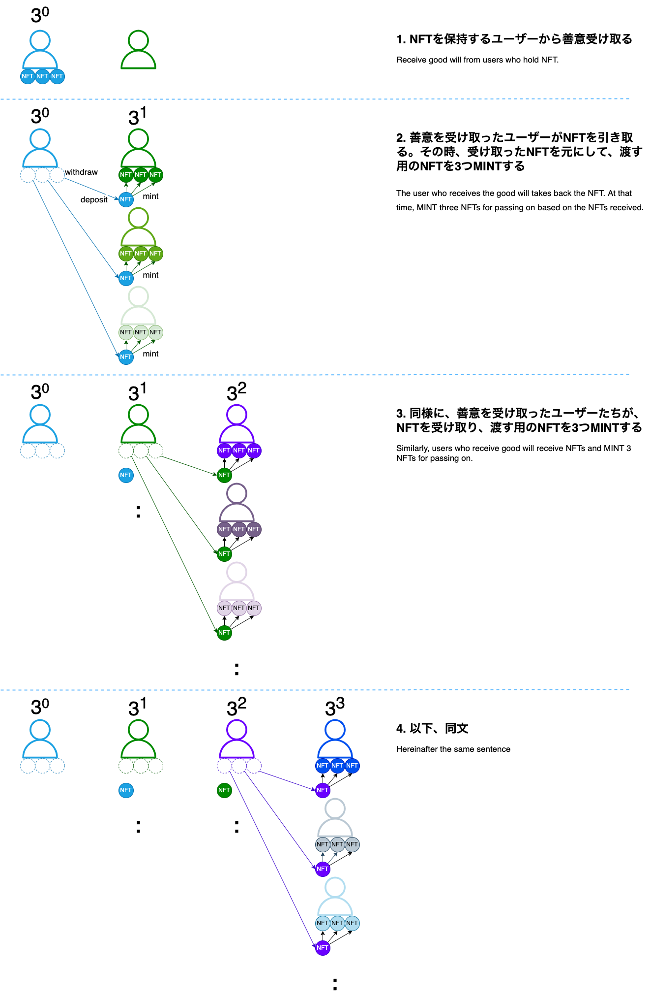

# README

> Let's make the world a better place. 

> ラスベガスに住むアルコール依存症の母と、家を出て行った家庭内暴力を振るう父との間に生まれた、少年トレバー。 中学1年生（アメリカでは7年生）になったばかりの彼は、社会科の最初の授業で、担当のシモネット先生と出会う。先生は「もし自分の手で世界を変えたいと思ったら、何をする?」という課題を生徒たちに与える。生徒達のほとんどは、いかにも子供らしいアイディアしか提案できなかったが、トレバーは違った。彼の提案した考えは、「ペイ・フォワード」。自分が受けた善意や思いやりを、その相手に返すのではなく、別の3人に渡すというものだ。

>[「ペイ・フォワード 可能の王国」](https://ja.wikipedia.org/wiki/%E3%83%9A%E3%82%A4%E3%83%BB%E3%83%95%E3%82%A9%E3%83%AF%E3%83%BC%E3%83%89_%E5%8F%AF%E8%83%BD%E3%81%AE%E7%8E%8B%E5%9B%BD)  
『フリー百科事典 ウィキペディア日本語版』2022年9月3日 (土) 16:37 UTC

## プロジェクト概要

このプロダクトは、2000年（日本は2001年）に公開された映画「ペイ・フォワード 可能の王国」をBlockchain上で構築したものです。  
主人公は世界をより良くする仕組みとして、誰かに良いことをしたら、その人には別の3人に対して良いことをしてもらい、さらに良いことをされた3人はそれぞれ別の3人へと善意のチェーンを繋げていく、というアイデアを考え、それを実行していきました。  
この映画を初めて見た時、単純だけど「うまく回れば」本当に世界を良くすることができる素晴らしいアイデアだなと、感動したことを今でも覚えています。  
しかし、「うまく回す」ことはアナログ世界では難しく、その人の裁量次第で善意のチェーンは簡単に途切れてしまうことでしょう。  
そこで今回はその善意のチェーンを可視化し次へのバトンパスを後押しするためにブロックチェーンを活用したシステムを構築しました。  
善意をNFTとしてはいますが、通常のNFTとは異なり、「善意を受け取った人に次に繋げるための善意のNFTを受け取ってもらう」ため、withdrawが公開できるようスマートコントラクトを書いています。

## アーキテクチャ

## NFT MINT FLOW

## 動作環境

- [STG環境(testnet)](https://d191pmcvnhlrz3.cloudfront.net/)
  - [ContractAccount](https://d191pmcvnhlrz3.cloudfront.net/0xcc211b65db2e5873/info)より初回の善意NFTを取得可能
- PRD環境(mainnet)

